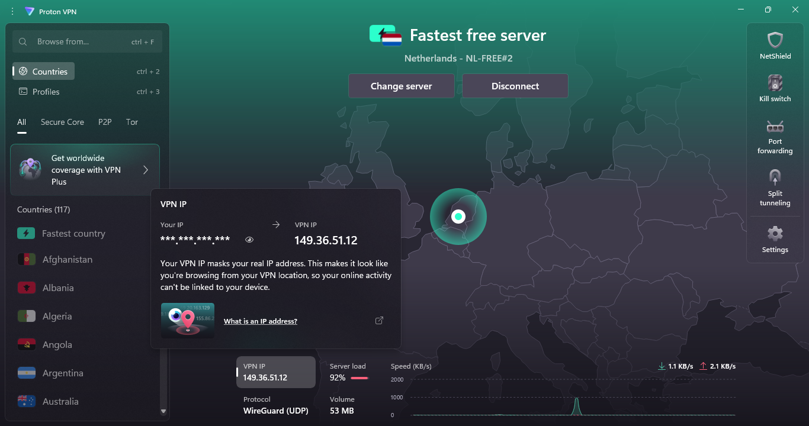

# task8-browser-vpnaudit

# Cyber Security Internship Task 8: VPN + Browser Audit

## 🔐 VPN Setup Summary

- **VPN Service:** ProtonVPN
- **Steps Taken:**
  1. Signed up and installed client
  2. Connected to server
  3. Verified IP and encryption
- **Before IP:** XXX.XXX.XXX.XXX (India)
- **After IP:** 149.36.51.12 (Netherlands)

## 🧠 VPN Benefits & Limitations

*(Summarized content above)*

## 🔍 Browser Extension Audit

- Removed: Video Downloader Pro, PDF Converter
- Reason: Suspicious permissions and behavior

## 📸 Screenshot

